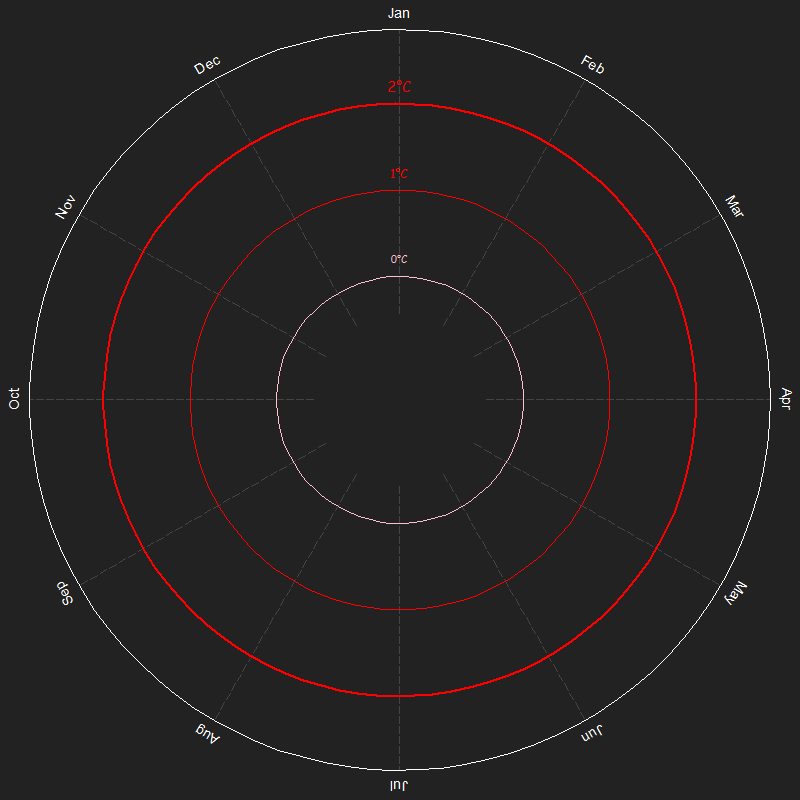

Estatistica-UFJF 5/9

# Sobre mim

Oi, meu nome é Bernardo e eu sou um estatístico em formação, gosto um
pouquinho demais de matemática e estou tentando fazer uns projetinhos
genéricos e publicar eles aqui no GitHub.

Muito provavelmente vou publicar eles completamente em inglês, só por
razões de demonstrar minha proficiência, já que ela é muito importante
no mundo moderno.

# projetos

- [Espiral
  climatica](https://github.com/Bernardo-727/Climate-spiral-in-base-R)

