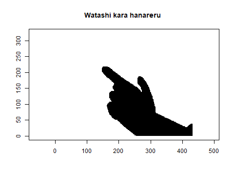

# Cursos e matérias

- Estatística-UFJF 6/9
  - Cálculo III
  - Algoritmos II   
  - Equações Diferenciais II
  - Estatística Computacional II
  - Inferência paramétrica I
  - Processos estocásticos  
  - Cálculo de probabilidades II  
  - Análise exploratória de dados

# Sobre mim

Oi, meu nome é Bernardo e eu sou um estatístico em formação, gosto um
pouquinho demais de matemática e estou tentando montar um portfólio de projetos genéricos aqui no GitHub.

Muito provavelmente vou deixar eles comentados em inglês, só para demonstrar minha proficiência (também para desenvolver um pouquinho mais de conforto com a escrita), já que ela é muito importante
no mundo moderno.

Quero evitar colocar "deveres de casa" aqui, já que eles geralmente são muito simples ou estão dentro do esperado para alguém que fez as mesmas matérias acima.

# Portfólio

- [Espiral
  climatica](https://github.com/Bernardo-727/Climate-spiral-in-base-R)

- [Animando um caminho](https://github.com/Bernardo-727/Path-animations)

- [Bad apple no R
  scatterplot](https://github.com/Bernardo-727/Bad-apple-in-R-scatterplot)

